# Hangman Game
(Developed by Daniel Lyons)


# Introduction
Welcome to the Hangman Game! This is a classic word guessing game that challenges your vocab and guessing skills to guess a secret word until you run out of lives. The game wa sinvented in the late 1800's and is still popular to this present day. User's will get 6 lives when trying to guess correct letters in the secret word. Each incorrect answer will reduce the user's lives by one life until the user either guesses the correct word or runs out of lives and hangman appears in our art animation. Enjoy.

You can play the game [here](https://chancandan-portfolio-project-3.herokuapp.com/).


## Contents

* (UX) - User Experience
* Game Design
* Features 
* Technologies Used
* Testing


## (UX) - User Experience

The game has been designed to provide both an engaging and enjoyable user experience for the players. An intuitive user interface, which is easy to use welcomes the users to the game. While the game features have been designed to the players motivated and engaged.

### User Stories

* As a website creator, I want to:

- 1 - Build an easy to play game in an app.
- 2 - Create and build a game that is fun while also a challenge for the player.

* As a new visitor, I want to:

- 1 - Get into the game quickly without too much time spent on figure out how to do so.
- 2 - Quickly see the game rules if I need help.
- 3 - Play and learn a new variation on an old classic game
- 4 - See how many lives I have left when I guess incorrectly.
- 5 - See what letters I have guessed correctly appear exactly where they are contained in the secret word.

* As a returning visitor, I want to:

- 1 - Increase game difficulty if I want to further challenge myself.
- 2 - Have a different word present itself for new games.
- 3 - Beat the game / device.

### Target Audience

- Kids
- People who enjoy games
- People who enjoy simple fun games


## Game Design

### Flowchart

* The game's logic is represented using flowcharts, which makes it easy to understand and debug.
* I used www.draw.io's (https://app.diagrams.net/) free flowchart designer to spend some time thinking about my logic and planning directions needed to get the flow of my project just right. I found this part of the project the most challenging and trying to get the logic pinned down first wasn't as easy as I first thought it would be.<br>

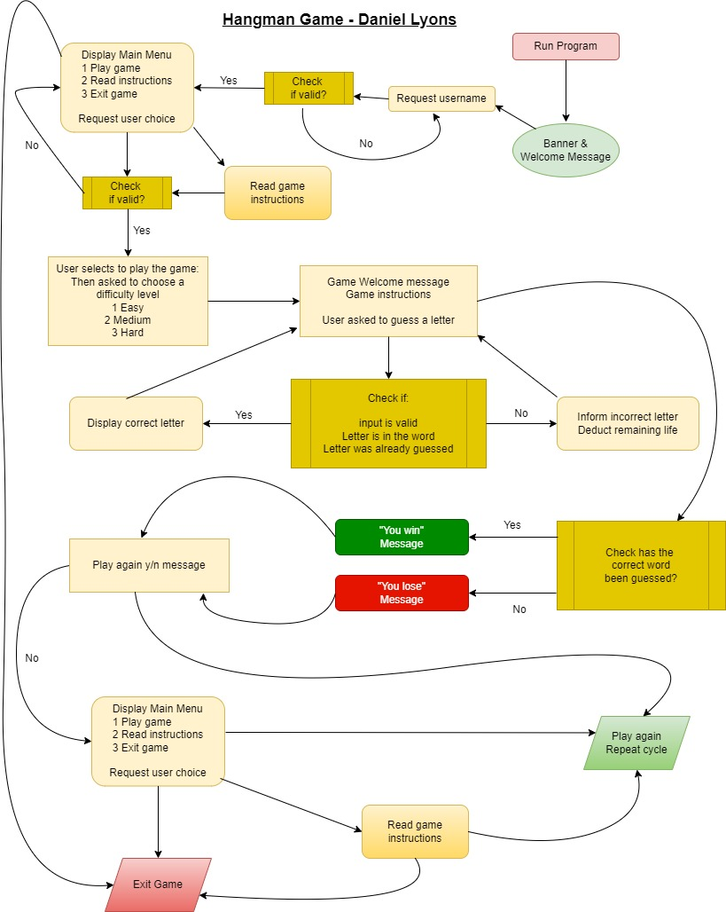


### Design

- The following were used int he design and development of this app.

* [Gitpod](https://gitpod.io)
* [Github](https://github.com/)
* [Favicon](https://favicon.io/favicon-converter/)
* [Random Word Generator](https://randomwordgenerator.com/)
* [ASCII art](https://www.twitchquotes.com/copypastas/ascii-art)
* [Flow Chart](https://www.draw.iot) 
* [Color Picker](https://imagecolorpicker.com/en) 


## Features 

### Welcome Message

* A simple heading / welcome message displaying the game name in a ASCII art that is in a design often used in gaming realted content.

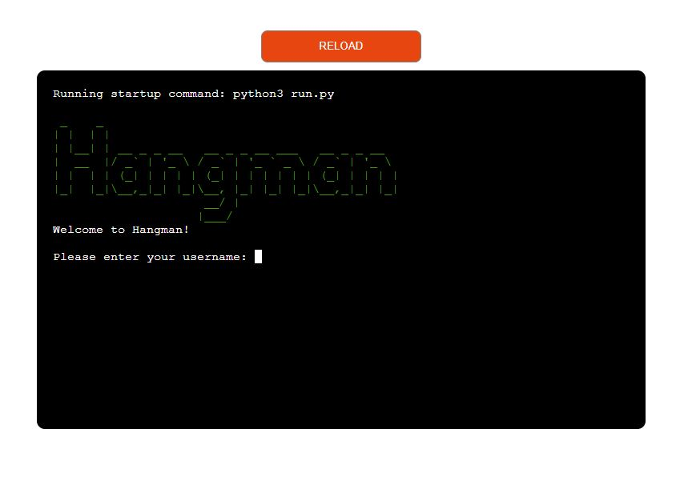

### Main Menu

* After entering a username the user will be presented with the main menu.
* User can choose from any of the following 3 options:

1 - Play the gmae<br>
2 - Read the game instructions<br>
3 - Exit the game
<br>


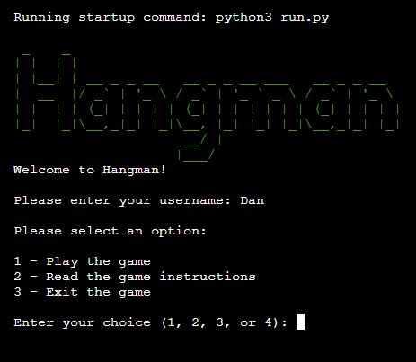

### Help / Game rules

* The user can call the game rules and instructions in the main menu. 
* Here they can see the simple rules behind the game.<br>
<br>

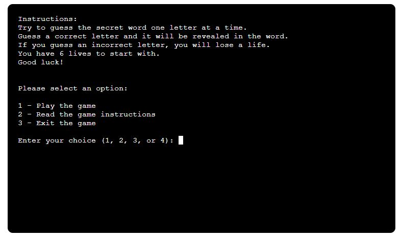


### Game Level / Difficulty

* Next, the player is prompted to choose which level they would like to play the game at.

- Easy
- Medium
- Hard
<br>

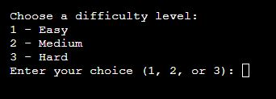
<br>


### Game Play
<br>

- Below is a screenshot of what we see after we choose a difficulty level of "Easy. Each difficulty level will look similar at first, the only difference being the harder the level the more letters in the words and less common words.
We have a game play welcome message customize with our username we entered at the beginning and we're presented with the game rules to remind us how to play. We can see a straight horizontal white line which is the beginning phase of the ASCII hangman art animation. Below this we see 4 dashes, each representing a letter of our secret word. So, the user now knows that there are 4 letters in this secret word. The remaining lives is displayed directly underneath this and we can see that there are 6 lives left, as that is what each game starts out with.

- The user is then promopted to guess a letter.<br>
<br>

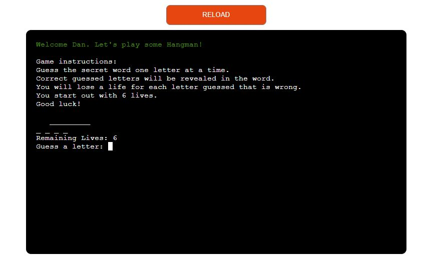


#### First Guess

- User enters first guess with the letter "b" and it's a very lucky guess at it's the correct letter. 

- A green "Correct" message appears above the gmae area and we can see that the letter "b" slots into
the first space of our 4 letter word. A great start for the the player. (See image below):

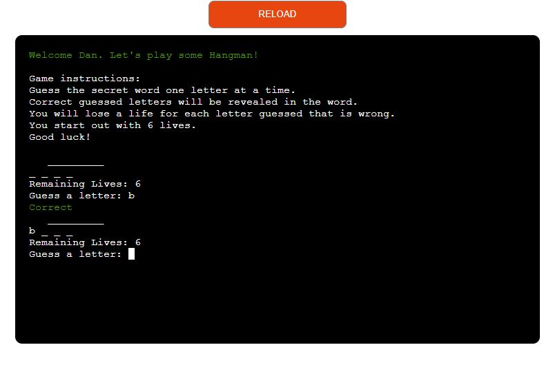

- The second guess is incorrect and the player has lost a life. We can see that there are
5 lives remaining now. Also, an incorrect answer clear the terminal of previous content. 
The "Incorrect" message that appears in a red color, and this is to signigy feedback to the user that they have lost a life. The hangman animation has added an piece of the image to signify this loss of a life also.


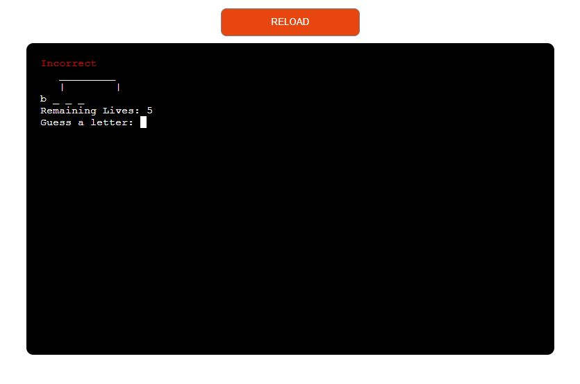

- Third guess is also incorrect and we can see that we have lost another life.
The hangman image now includes the man's head in the ASCII art.

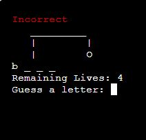

- A correct guess next sees the player get another letter correct. This time it's the letter "d" and we can see that it occupys the last space of our 4 letter word.

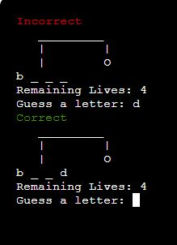

- With 2 letters correct and placed in our secret worth the player quickly gets another correct.
We can see that ASCII art images does not get large when a guess is correct. This ticks off one of the testing boxes
and we know this is functioning correctly as we have seen in previous guesses that it gets larger on an incorrect guess.

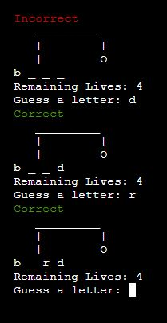

- The remaining lives are down to 3 after another incorrect guess.
The ASCII artwork also takes the form of a boday and hands to coincide with this.

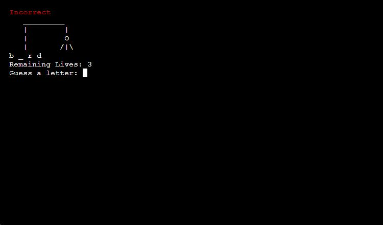

- Player loses another life and the AscII art gains too. 
Terminal clears past incorrect guesses to keep the space clear and clean.


- User loses another life, just 1 remaining life now.

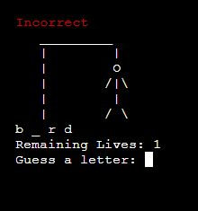

- Success, the player wins! 
A green message appears underneath our hangman to say "You win! You guessed the word, well done".
The user is then asked if they would like to play another game. y/n
If the user selects "y" then the game restarts.
If the user selects "n" they are brought out to the main menu again where they can choose to read game instructions, exit the game or if they want to change their mind they can choose to play game.

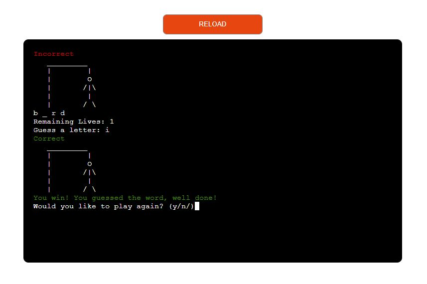


#### Game Over!

- Once the player guesses incorrectly all 6 lives are lost and the hagman image is complete.
- A message appears to provide the user with further feedback on this saying "Game Over!
You lost. The answer was: Cup"
- The player also gets to see where what the correct answer that they were trying to guess was.

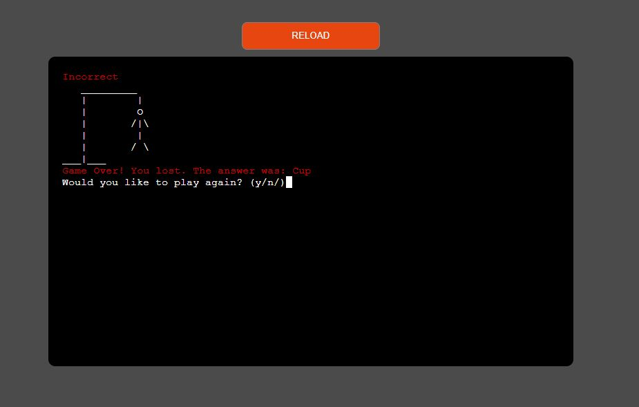


## Future feautres

- In future updates to this app the following will be added.

* High scores and rankings
* Hints to help guess words
* An expanded word list for more words


## Technologies Used

### Languages Used

* Python
* CSS3
* HTML5


### Python Packages
 - random
- json


### Frameworks - Libraries - Programs Used
Git
GitHub

## Testing

### User Input Validation

* The first thing the user has to do is enter a username. However, it must be at least 3 characters in length.
If the user enters anything under 3 chjaracters they see an "Invalid input!" error and an explaination that they're required to enter at least 3 characters for their username. (See image below)

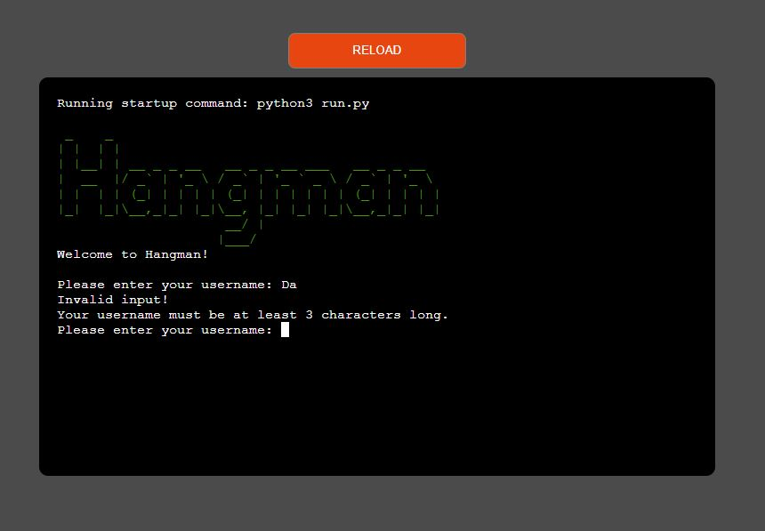

### Invalid Main Menu Input

* After entering a correct username the player is then asked to choose from 1 of 3 options on the main menu.
If the user does not enter either 1, 2, or 3 then they are hit with the invalid input message seen in the image (below). They are then again prompted to choose from either option 1, 2, or 3.

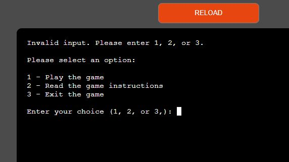

### Invalid Difficulty Level

* Next, the player must choose a difficulty between Easy, Medium and Hard. If the user enters anything other
than 1, 2, or 3 then they see the invalid input message seen in the below image and are prompted once more to make 
their choice again. Once the y do then the game begins!

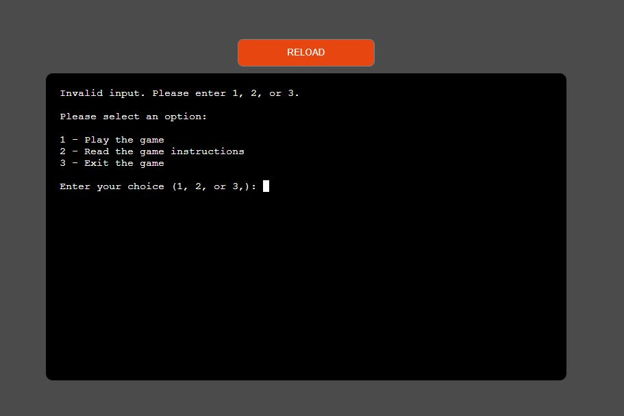

### PEP 8 Online

* Code Institute's Python Linter was used to test my python code to the PEP8 standards and adjustments were made to make sure my code was up to these standards. Throughout the development of this game I had various errors in my code as shown in the image below;

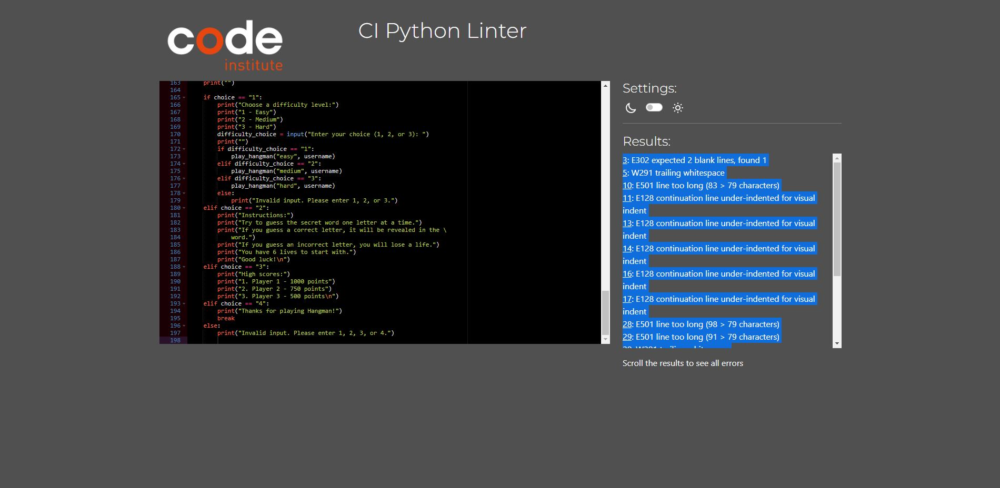

* I debugged and fix all listed errors.<br>
At the end of development the game's python code satisfy's<br>
PEP 8's standards for python code as seen blow.

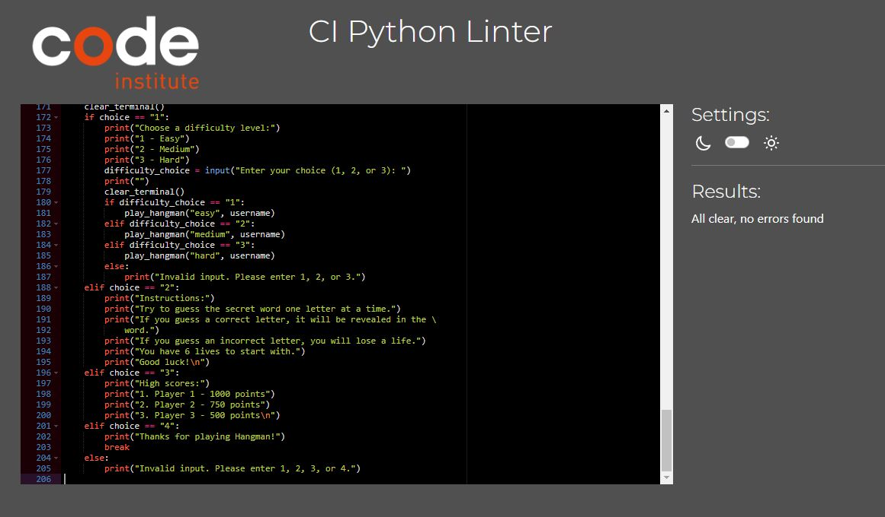

### Lighthouse Testing

* The app was taken through Google's Lighthouse testing and achieved the scores seen in the image below.
The scores for best practices and SEO could be improved upon however a template was used for this project from Code Insititute and the focus on this project is not on html5 and CSS3, but more on the python code used. The app performs 
well and is accessible.

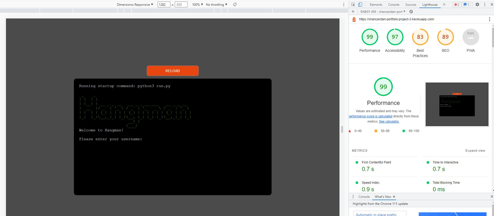

## Deployment

### Deployment to Heroku App

- The Hangman Game app was deployed to GitHub pages. The following steps were taken when deploying: 
  - Navigate to the Settings tab in the heroku dashboard. 
  - Select cong var and input "Port" and 8,000
  - Select 'Build packages' from the menu and first choose Python, add it. Then repeat and choose node.js and add it.
  - Then chose to deploy from github and search for the correct repository. Then manually deploy.
  - After a short wait a the app will be deployed live to the web.

The game's live link can be found here - https://chancandan-portfolio-project-3.herokuapp.com/

### Version Control

During the development of the site, When pushing code to the remote repository, I used the following git commands 

```git add .``` - All files added to a staging area awaiting the commit phase.

```git commit -m “specific commit message”``` - To commit changes to the local repository queue where they become ready for the push phase.

```git push``` - All commited code would be then pushed to the site's repo on github.

## Credits

### Content

* The terminal function and template for the deployable application was provided by [Code Institute - Template](https://github.com/Code-Institute-Org/python-essentials-template)
  
### Resources and other information

* [Stack Overflow](https://stackoverflow.com/)
* [W3Schools - Python](https://www.w3schools.com/python/)


## Credits and Acknowledgements

A variety of contributors and help went into the development this game app:

* My class and course facilitator have been great help in our slack group during this project.

* https://www.youtube.com/watch?v=cJJTnI22IF8 a good Yuotube tutorial I watched to gain an understanding behind the logic required to develop my project

* https://itsourcecode.com/free-projects/pygame/code-for-game-in-python/#google_vignette

* https://ibb.co/Y8tk3cg

* https://gist.github.com/chrishorton/8510732aa9a80a03c829b09f12e20d9c

* https://www.devdungeon.com/search/node/hangman

* https://ascii.co.uk/art/hangman

* Youtube tutorial https://www.youtube.com/watch?v=m4nEnsavl6w was another tutorial I watched to gain an understanding of how to use python for my project.

* Finally, my mentor Gareth has been great in helping me clearly understand the project brief and nudging me in the right direction when I've come unstuck.


